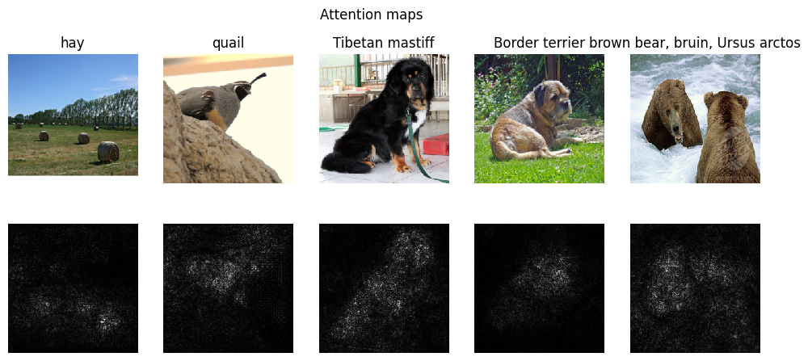
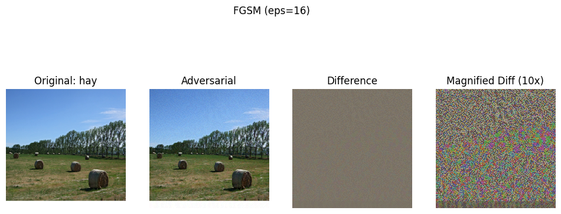

# Adversarial Effect in Deep Learning

This repository contains a proof of concept (POC) project exploring how each pixel in an input image affects model predictions. The project also delves into creating adversarial examples using gradient-based techniques.

## Project Overview

### 1. Attention Maps

The first part of this project focuses on generating attention maps to understand the importance of each pixel in the input image for the model's prediction. By computing the gradient with respect to each pixel, we can assess how much the output changes when that pixel is altered.

**Steps Involved:**
- Compute the gradient with respect to the input image.
- Take the absolute value of the gradient to disregard the sign.
- Compute the max gradient value across the red, green, and blue channels.
- The resulting attention map highlights the importance of each pixel in the input image for the model's prediction.

This method is based on the technique described in section 3.1 of the paper [Explaining and Harnessing Adversarial Examples](https://arxiv.org/pdf/1312.6034.pdf).

### 2. Adversarial Examples

In the second part, the focus shifts to generating adversarial examples using two well-known techniques:

- **Fast Gradient Sign Method (FGSM):** This method perturbs the input image in the direction of the gradient, causing the model to misclassify the image.
- **Iterative Gradient Sign Method (IGSM):** This method iteratively applies small perturbations to the input image, gradually increasing the adversarial effect.

**Exploration:**
- Implemented FGSM and IGSM as described in the papers:
  - [Adversarial Examples in the Physical World](https://arxiv.org/pdf/1607.02533.pdf) (Sections 2.1 and 2.2)
  - [Explaining and Harnessing Adversarial Examples](https://arxiv.org/pdf/1412.6572.pdf)
- Explored different values of epsilon ($\epsilon \in \{2,4,8,16\}$) to observe the impact on the model's predictions.

## Results

- **Attention Maps:** Visualizations generated from the attention maps reveal which regions of the image are most influential in the model's decision-making process.
- **Adversarial Examples:** The generated adversarial examples demonstrate how small perturbations can significantly alter the model's output, particularly as the epsilon value increases.

## Requirements

- Python 3.x
- PyTorch
- NumPy
- Matplotlib (for visualization)

## References

- Goodfellow, Ian J., Jonathon Shlens, and Christian Szegedy. Explaining and Harnessing Adversarial Examples.
- Kurakin, Alexey, Ian J. Goodfellow, and Samy Bengio. Adversarial Examples in the Physical World.

## Acknowledgments

Special thanks to the researchers and authors of the papers referenced for their foundational work in adversarial machine learniing.
